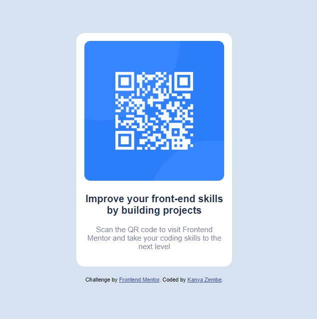

# Frontend Mentor - QR code component solution

This is a solution to the [QR code component challenge on Frontend Mentor](https://www.frontendmentor.io/challenges/qr-code-component-iux_sIO_H). Frontend Mentor challenges help you improve your coding skills by building realistic projects. 

## Table of contents

- [Overview](#overview)
  - [Screenshot](#screenshot)
  - [Links](#links)
- [My process](#my-process)
  - [Built with](#built-with)
  - [What I learned](#what-i-learned)
  - [Continued development](#continued-development)
  - [Useful resources](#useful-resources)
- [Author](#author)
- [Acknowledgments](#acknowledgments)

## Overview

In this project, I dealt mainly with html and css, which was a straightforward concept. I built the gr-code component using react javascript. 
### Screenshot



### Links

- Solution URL: [QR code solution](https://qrcodecomponentzembezn.netlify.app/)

## My process

 I created a react boiler plate set up, set up the html layout, then created a component and added the image and text. I then created a globalstyle file using styled components for the css which was much quicker and easier. 
### Built with

- Semantic HTML5 markup
- Flexbox
- [React](https://reactjs.org/) - JS library
- [Styled Components](https://styled-components.com/) - For styles

### What I learned

I learned how to use styled components and played around with a bit of flexbox to add CSS which was a fairly new concept to me but I quickly got the gist of it all and managed to successfully implement the styling. I broadened my google inspection tools knowledge when editing and styling the page. 

```css
body {
    font-family: 'Outfit', sans-serif;
    background-color: hsl(212, 45%, 89%);
    min-height: 100vh;
    display: flex;
    align-items: center;
    font-size: 15px;
    width: 100%;
    justify-content: center;
}
```
```js
export const Card = styled.div`
width: 100% ;
  max-width: 280px;
  margin: 0 auto;
  background-color: hsl(0, 0%, 100%);
  padding: 16px;
  border-radius: 17px;
  text-align: center;
`
```
### Continued development

I want to be more familiar with styled components and flexbox as these are quick and easy ways to style pages.

### Useful resources

- [Styled Components](https://styled-components.com/docs/basics#getting-started) - This helped me style and set up the layout of the page.
- [Style Guide](https://airbnb.io/javascript/react/) - This is a style guide by airbnb which shows you the correct ways to write your code. I'd recommend it to anyone still learning this concept.

## Author

- Frontend Mentor - [@jinxmonsoon](https://www.frontendmentor.io/profile/jinxmonsoon)

## Acknowledgments

Thank you to my friend James Nicholson for the sound advice and guidance. 
